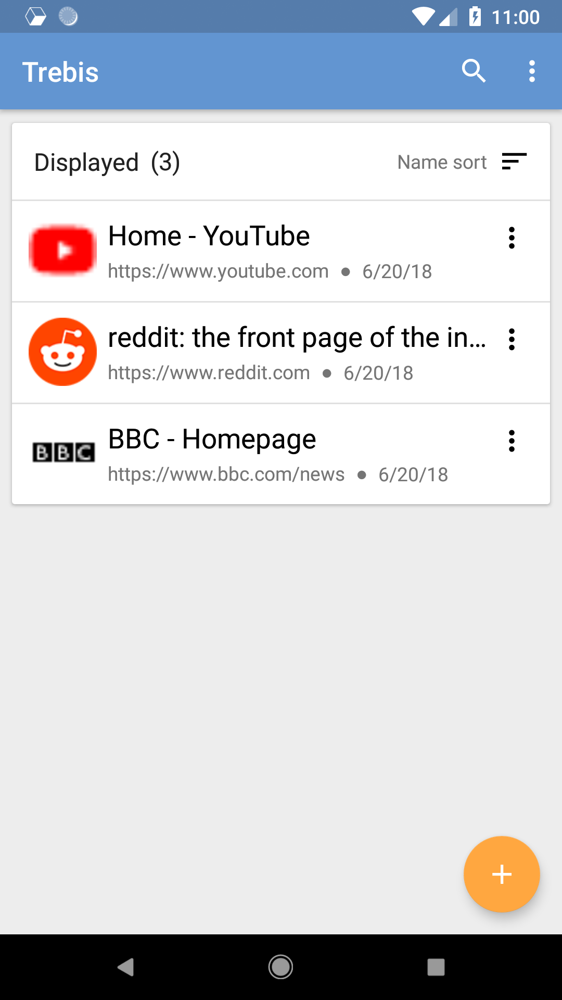
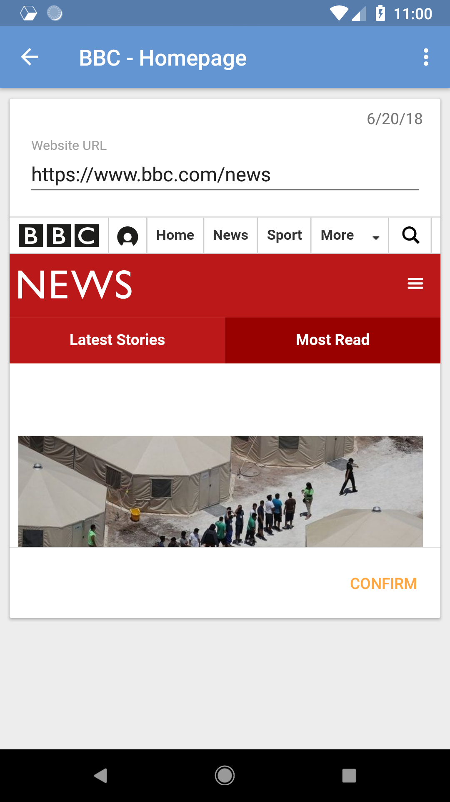
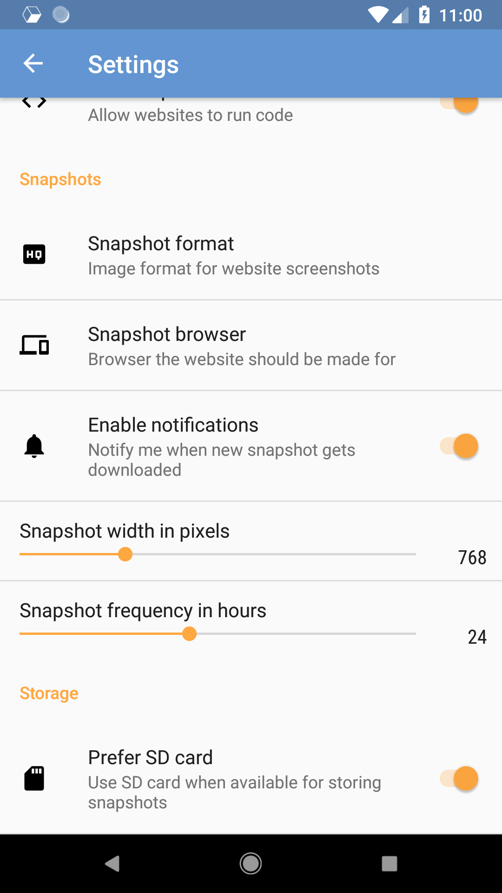
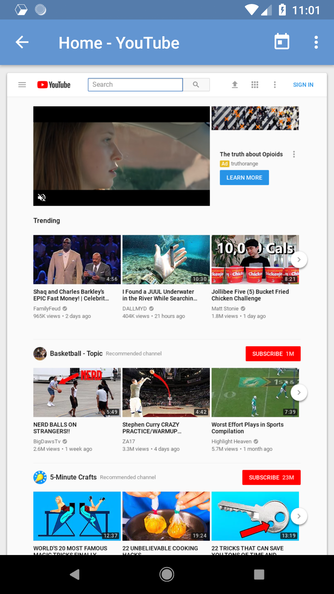
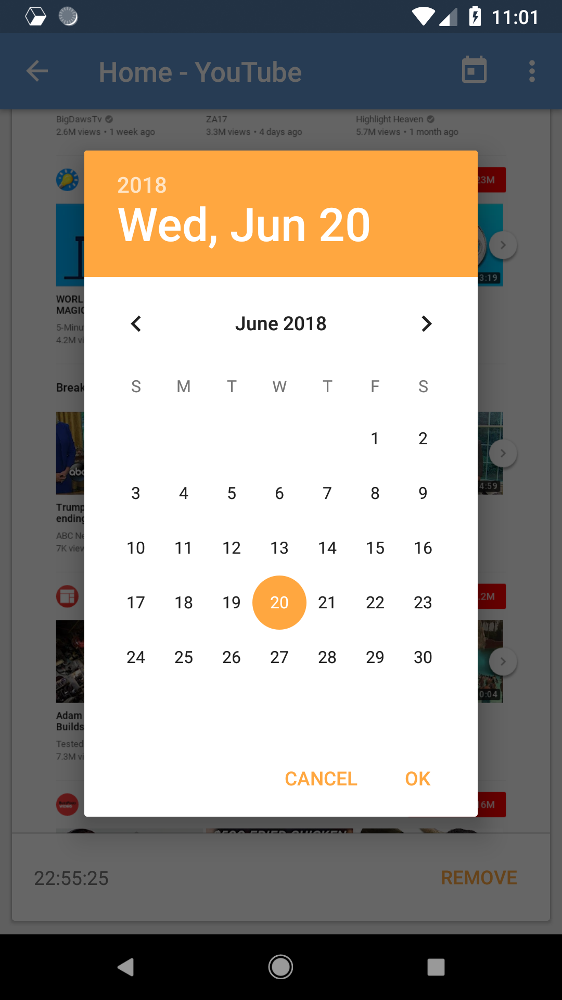

# Trebis  
> Web archive application that scrapes and stores websites for offline viewing

The application will automatically scrape and notify you of updates on your websites.
After that you can view version from any point in time you want. Allowing you to read
the contents at any time even without internet connection.

Šimon Kocúrek – simon.kocurek@gmail.com
